# Rust Editor Architecture

This document describes the high-level architecture of Rust Editor, its core components, and the design decisions behind them.

## Overview

Rust Editor is built with a modular architecture, consisting of several core components:

```
rust-editor/
├── editor-core/      # Core text editing engine
├── editor-ui/        # GUI implementation
├── editor-syntax/    # Syntax highlighting
├── editor-lsp/       # LSP support
├── editor-plugin/    # Plugin system
└── rust-editor/      # Main application
```

## Core Components

### Editor Core (editor-core)

The core text editing engine implements fundamental text manipulation operations:

- **Buffer Management**: Uses a rope data structure for efficient text manipulation
- **Document Management**: Handles file loading, saving, and metadata
- **Event System**: Provides event dispatching for editor state changes
- **History Management**: Implements undo/redo functionality
- **Marker System**: Manages text markers and annotations

Key design decisions:
- Use of rope data structure for optimal performance with large files
- Async I/O operations for responsive editing
- Event-driven architecture for loose coupling

### GUI (editor-ui)

The GUI layer is built using egui and provides:

- **Main Window**: Application window and layout management
- **Editor View**: Text editing area with syntax highlighting
- **Widgets**: Reusable UI components (tabs, status bar, etc.)
- **Command Palette**: Quick command execution interface
- **File Explorer**: Project file navigation

Key design decisions:
- Use of egui for cross-platform GUI
- Component-based architecture for reusability
- Responsive design with async operations

### Syntax Highlighting (editor-syntax)

Syntax highlighting is implemented using tree-sitter:

- **Parser**: Language-specific syntax parsing
- **Highlighter**: Token-based syntax highlighting
- **Theme System**: Customizable color schemes
- **Language Support**: Extensible language definitions

Key design decisions:
- Use of tree-sitter for robust parsing
- Incremental parsing for performance
- Theme system for customization

### LSP Support (editor-lsp)

Language Server Protocol implementation:

- **LSP Client**: Communication with language servers
- **Protocol Handling**: LSP message processing
- **Feature Integration**: Code intelligence features
- **Diagnostics**: Error and warning display

Key design decisions:
- Async communication with language servers
- Extensible protocol implementation
- Integration with editor features

### Plugin System (editor-plugin)

Plugin architecture for extensibility:

- **Plugin Loading**: Dynamic loading of plugins
- **API**: Plugin development interface
- **Sandbox**: Security isolation
- **Event System**: Plugin event handling

Key design decisions:
- Support for both native and WebAssembly plugins
- Sandboxed execution environment
- Event-based communication

## Data Flow

```mermaid
graph TD
    A[User Input] --> B[Editor UI]
    B --> C[Command System]
    C --> D[Editor Core]
    D --> E[Document]
    E --> F[Buffer]
    F --> G[Event System]
    G --> H[Plugins]
    G --> I[LSP]
    G --> J[Syntax Highlighting]
    J --> K[UI Update]
    I --> K
    H --> K
```



## State Management

The editor uses a hierarchical state management system:

1. **Global State**
   - Editor configuration
   - Open documents
   - Plugin registry
   - Theme settings

2. **Document State**
   - Buffer content
   - Cursor positions
   - Selection ranges
   - Syntax highlighting
   - LSP state

3. **UI State**
   - Window layout
   - Panel visibility
   - Focus state
   - Scroll positions

## Performance Considerations

1. **Text Editing**
   - Rope data structure for efficient insertions/deletions
   - Chunk-based loading for large files
   - Incremental updates

2. **Syntax Highlighting**
   - Incremental parsing
   - Background processing
   - Cache management

3. **LSP Integration**
   - Async communication
   - Request debouncing
   - Result caching

## Security

1. **Plugin Sandbox**
   - Limited file system access
   - Network restrictions
   - Resource limits

2. **Input Validation**
   - Command validation
   - File path sanitization
   - LSP message validation

## Error Handling

1. **Error Types**
   - Editor errors
   - Plugin errors
   - LSP errors
   - I/O errors

2. **Recovery Strategies**
   - Automatic save backups
   - Plugin isolation
   - State recovery

## Testing Strategy

1. **Unit Tests**
   - Component-level testing
   - Mocked dependencies
   - Property-based testing

2. **Integration Tests**
   - Cross-component testing
   - Plugin system testing
   - LSP protocol testing

3. **End-to-End Tests**
   - UI interaction testing
   - File operation testing
   - Plugin integration testing

## Future Considerations

1. **Scalability**
   - Multiple window support
   - Remote development
   - Collaborative editing

2. **Extensibility**
   - Additional language support
   - Plugin marketplace
   - Custom UI themes

3. **Performance**
   - WebGPU rendering
   - Worker thread optimization
   - Memory optimization

## Contributing

When contributing to the editor, consider:

1. **Code Organization**
   - Follow the modular architecture
   - Keep components loosely coupled
   - Use appropriate abstractions

2. **Performance**
   - Profile critical paths
   - Consider memory usage
   - Test with large files

3. **Testing**
   - Write comprehensive tests
   - Include performance tests
   - Document test cases

4. **Documentation**
   - Update architecture docs
   - Document design decisions
   - Provide examples

## Resources

- [Rope Science](https://github.com/xi-editor/xi-editor/blob/master/docs/rope_science/intro.md)
- [LSP Specification](https://microsoft.github.io/language-server-protocol/specifications/specification-current/)
- [tree-sitter Documentation](https://tree-sitter.github.io/tree-sitter/)
- [egui Documentation](https://docs.rs/egui/)
